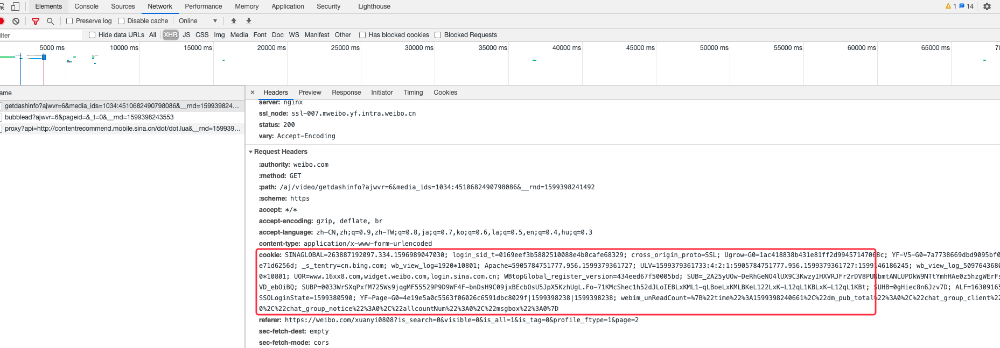
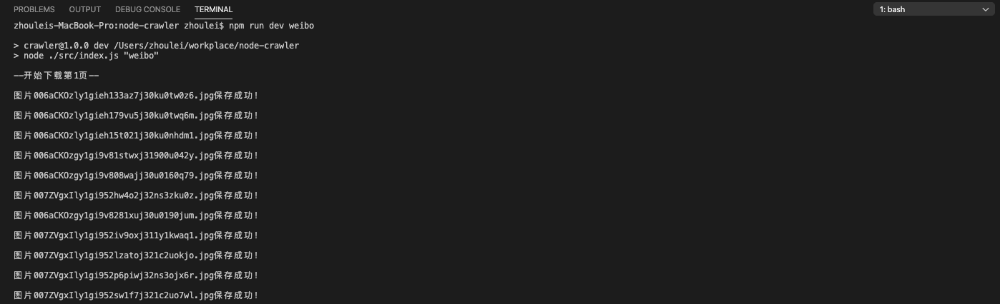

# node-crawler

nodejs 爬虫，包括不限于微博，instagram，图片和视频。

## 微博

爬取某个用户的全部图片和视频，源码在 `src/weibo/` 下。

### 修改配置

打开 `src/weibo/config.js` 文件

**填写 `COOKIE`**

首先登录微博网页版，然后按 `f12` 打开调试面板，进入 Network ，随便找一个请求，即可获取 cookie。



**填写 `SCRIPT_URI`**

点开你要爬取数据的用户的主页，然后查看浏览器地址栏的域名，主要有两种：

-   一般域名：https://weibo.com/u/5653796775
-   个性域名：https://weibo.com/liuyifeiofficial

一般域名的 SCRIPT_URI 为 `/u/5653796775`，而个性域名的 SCRIPT_URI 为 `/liuyifeiofficial`。

### 运行项目

```node
git clone https://github.com/xikong1995/node-crawler.git

cd node-crawler

npm i

npm run dev weibo
```

如果不出意外，你将看到如图所示的内容：



最后你可以在 `src/weibo/assets/` 下看到所下载的图片和视频。

## Instagram

爬取某个用户的全部图片和视频，源码在 `src/instagram/` 下。

### 修改配置

打开 `src/instagram/config.js` 文件

**填写 `COOKIE`**

首先登录 Instagram 网页版，然后按 `f12` 打开调试面板，进入 Network ，随便找一个请求，即可获取 cookie。


**填写 `USERNAME`**

点开你要爬取数据的用户的主页，然后查看浏览器地址栏的域名，`https://www.instagram.com/dlwlrma/`，USERNAME 填 `dlwlrma` 即可。

**填写 `PROXY`**

由于在国内无法访问 instagram，所以你需要科学上网。本人用的 Shadowsocks，其默认代理地址为 `http://127.0.0.1:1087`。

### 运行项目

```node
git clone https://github.com/xikong1995/node-crawler.git

cd node-crawler

npm i

npm run dev instagram
```

如果不出意外，你将看到如图所示的内容：


最后你可以在 `src/instagram/assets/` 下看到所下载的图片和视频。

## 说明

此项目仅供学习使用，本人不对任何商业用途负责。如果在使用过程中有任何问题，欢迎联系我，邮箱 zhouleiwit@163.com。
